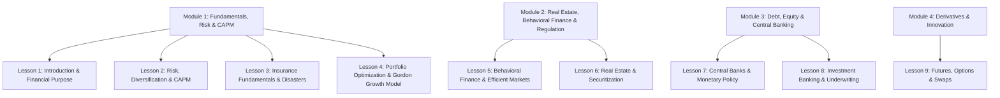

# Yale University: Financial Markets (Prof. Robert Shiller) — Comprehensive Study & Analytical Notes

**Instructor:** Prof. Robert J. Shiller (Nobel Laureate in Economics, Yale University)  
**Author / Scholar:** Gia Bao Huynh (Jun)  
**Status:** In Progress (Lessons 1 & 2 Completed — 100% Perfect Score)  
**Tags:** #Finance #FinancialMarkets #Yale #Economics #RiskManagement #CAPM #BehavioralFinance #Obsidian

---

## 1. Course Philosophy & Macro Architecture
Prof. Robert Shiller frames financial markets not merely as vehicles for personal wealth accumulation (*"This course is not about how to make money"*), but as **indispensable social technologies**:
1. **Capital Allocation:** Directing societal resources toward transformative human enterprise and scientific innovation.
2. **Risk Pooling & Redistribution:** Allowing individuals and institutions to undertake high-risk, high-reward endeavors by dispersing risk across capital markets.
3. **Incentive Alignment:** Structuring contracts, securities, and governance to align private action with broad public value.

---

## 2. Lesson 1: Introduction, Roles, and Purpose of Financial Markets
### Key Conceptual Insights
- **Societal Role of Finance:** Finance provides the infrastructure to convert collective savings into productive long-term investments, infrastructure, and innovation.
- **Occupational & BLS Projections:**
  - High-growth financial professions (e.g. *Personal Financial Advisors*) play a critical advisory and fiduciary role in allocating household capital.
  - Comparative BLS employment figures contextualize financial specializations within the broader macroeconomic labor market.
- **Andrew Carnegie's *Gospel of Wealth*:**
  - Carnegie asserted that excessive wealth accumulation imposes a moral obligation: wealth should not be hoarded or passed down through generations to create dynastic privilege, nor should giving be postponed until death (*"The man who dies thus rich dies disgraced"*).
  - Wealthy individuals should retire early and commit their executive abilities to public philanthropy while still vigorous.
- **Multi-Dimensional Impact of Finance:**
  - Financial markets attract capital globally, can be deployed for constructive or destructive purposes, and constitute foundational infrastructure for modern economic development.

---

## 3. Lesson 2: Risk, Diversification, VaR, Stress Testing, and CAPM
### Key Analytical Constructs

#### 1. Value at Risk (VaR)
- **Definition:** A statistical technique measuring the maximum potential loss on an investment portfolio over a specified time horizon at a given confidence level.
- **Interpretation Example:** A *5% 3-month VaR of $1,000,000* indicates a **5% probability (or 1 in 20 chance) that the portfolio will decline in value by $1,000,000 or more over the next 3 months**.

#### 2. Stress Testing & Scenario Analysis
- **Distinction from Historical Backtesting:** While standard risk models rely on historical covariance matrices, stress testing explicitly evaluates:
  - Complex institutional interconnections and systemic counterparty exposures.
  - Plausible macroeconomic and financial tail-risk crises (e.g., rapid currency depreciations, sudden liquidity freezes, interest rate spikes).
  - Portfolio vulnerabilities under unprecedented conditions not captured by recent historical time series.

#### 3. Systematic Risk vs. Idiosyncratic Risk
- **Systematic (Market) Risk:**
  - Risk inherent to the entire market or macroeconomic environment (e.g., recessions, inflation shocks, geopolitical conflicts).
  - Cannot be eliminated through diversification.
- **Idiosyncratic (Firm-Specific) Risk:**
  - Risk endemic to an individual company or single asset (e.g., product failure, executive scandal, firm-specific supply disruptions).
  - Can be diversified away by holding a broad basket of non-correlated assets (e.g., investing in index funds rather than single large equities like Walmart or Apple).

#### 4. Capital Asset Pricing Model (CAPM)
- **Formula:**
  $$E(R_i) = R_f + \beta_i \left(E(R_m) - R_f\right)$$
- **Beta (\beta):** The precise mathematical measure of **systematic risk**, quantifying the sensitivity of an asset's returns relative to the overall market portfolio.
  - $\beta = 1.0$: Asset moves in lockstep with the market.
  - $\beta > 1.0$: Asset exhibits amplified volatility / systematic sensitivity.
  - $\beta < 1.0$: Asset is less sensitive to market-wide fluctuations.

#### 5. Non-Normality & Fat Tails in Financial Asset Returns
- **Failure of the Gaussian (Normal) Distribution:**
  - Standard normal distributions assume that extreme outlier events (3+ standard deviations) occur with negligible frequency.
  - Real-world financial returns exhibit **heavy tails (leptokurtosis)**: black swan crashes and sudden liquidity collapses happen with vastly higher empirical frequency than predicted by Gaussian models.
  - Normal distribution is inadequate because **it does not have enough outliers** to reflect real market dynamics.

---

## 4. Course Curriculum Map (Yale Financial Markets)

---

## Quiz Performance Record
| Module / Lesson | Score | Assessment Status |
|---|---|---|
| Lesson #1 Quiz | **100%** (4/4) | Passed / Verified |
| Lesson #2 Quiz | **100%** (6/6) | Passed / Verified |
| Lesson #8 Quiz (Debt & Bonds) | **100%** (8/8) | Passed / Verified |
| Lesson #9 Quiz (Stocks & Governance) | **100%** (9/9) | Passed / Verified |

*Detailed question-by-question breakdown & theoretical proofs available at [[Coursera_Yale_FM_Week3_Quiz_Results]].*

---
*Related Notes: [[Google_AI_Professional_Certificate_Mastery]], [[08_Academic_Mastery_and_Curriculum_Index]], [[01_LAC_Core_Apparatus]]*

